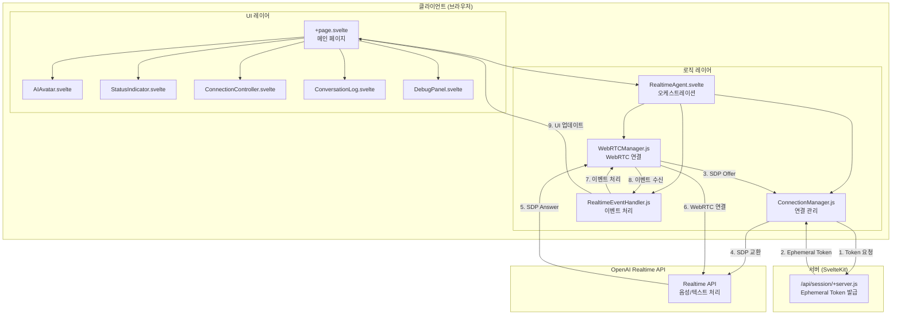
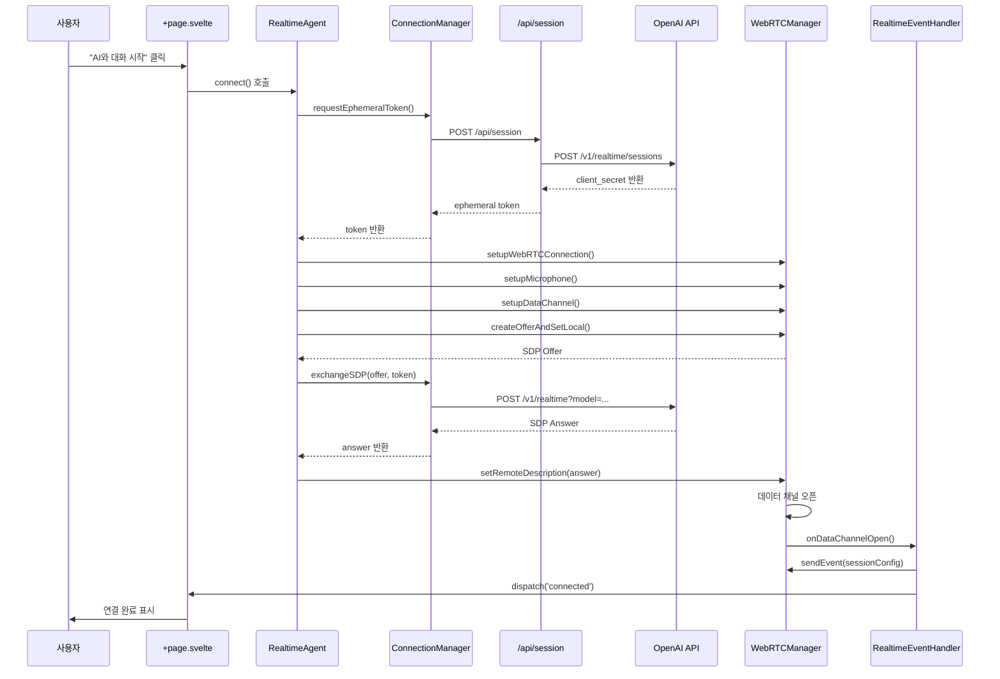
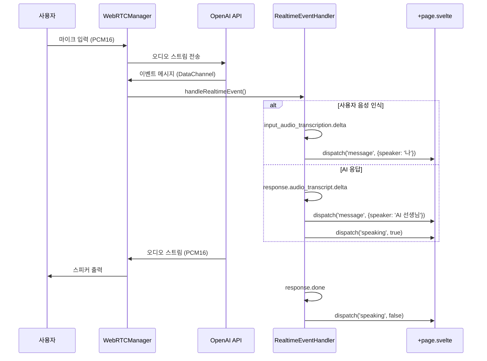
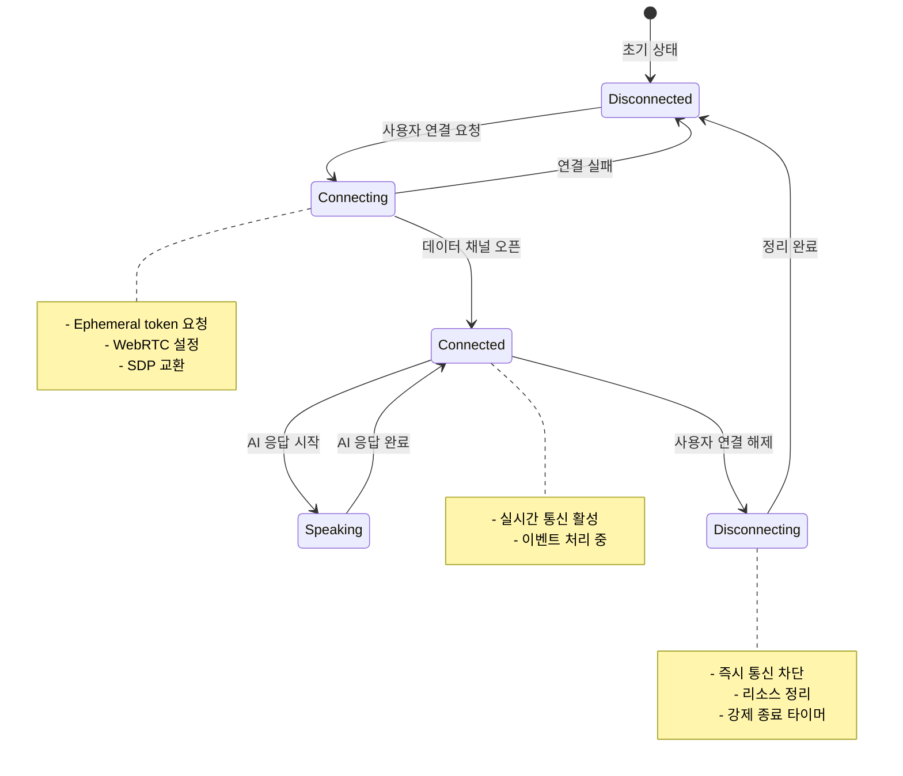

# 프로젝트 아키텍처

## 프로젝트 개요

### 기술 스택
- **프레임워크**: SvelteKit (Svelte 5)
- **스타일링**: TailwindCSS 4
- **AI 통신**: OpenAI Realtime API (gpt-4o-realtime-preview)
- **실시간 통신**: WebRTC (RTCPeerConnection + RTCDataChannel)
- **배포**: Vercel
- **테스팅**: Vitest, Testing Library

### 핵심 기능
- 실시간 음성 대화 (WebRTC 기반 초저지연 통신)
- AI 영어 선생님 (발음/문법 교정)
- 대화 기록 (실시간 텍스트 변환 및 히스토리)
- 연결 상태 모니터링 (디버그 패널 포함)

### 프로젝트 목적
OpenAI Realtime API를 활용한 실시간 영어 회화 학습 애플리케이션

## 전체 아키텍처



### 레이어 설명
- **UI 레이어**: 사용자 인터페이스 컴포넌트 (표시 및 입력)
- **로직 레이어**: 비즈니스 로직 및 통신 관리 (Manager 패턴)
- **서버 레이어**: API 키 보호 및 ephemeral token 발급
- **외부 API**: OpenAI Realtime API (음성/텍스트 처리)

## 디렉토리 구조

```
my-speaking-ai/
├── src/
│   ├── lib/
│   │   └── components/          # 재사용 가능한 컴포넌트 및 매니저
│   │       ├── RealtimeAgent.svelte      # 통신 오케스트레이션
│   │       ├── WebRTCManager.js          # WebRTC 연결 관리
│   │       ├── ConnectionManager.js      # 연결 설정 및 SDP 교환
│   │       ├── RealtimeEventHandler.js   # OpenAI 이벤트 처리
│   │       ├── AIAvatar.svelte            # AI 아바타 UI
│   │       ├── StatusIndicator.svelte    # 연결 상태 표시
│   │       ├── ConnectionController.svelte # 연결 제어 버튼
│   │       ├── ConversationLog.svelte     # 대화 기록 표시
│   │       └── DebugPanel.svelte          # 디버그 정보 패널
│   │
│   ├── routes/
│   │   ├── api/
│   │   │   └── session/
│   │   │       └── +server.js    # Ephemeral token 발급 API
│   │   │
│   │   ├── +layout.svelte        # 레이아웃
│   │   └── +page.svelte          # 메인 페이지
│   │
│   ├── app.html                  # HTML 템플릿
│   └── app.css                   # 전역 스타일
│
├── static/                       # 정적 파일
│   └── favicon.png
│
├── .env.example                  # 환경 변수 예시
├── package.json                  # 의존성 및 스크립트
├── svelte.config.js              # SvelteKit 설정
├── vite.config.js                # Vite 설정
└── eslint.config.js              # ESLint 설정
```

### 디렉토리 역할
- `src/lib/components/`: 재사용 가능한 컴포넌트 및 비즈니스 로직 매니저
- `src/routes/`: SvelteKit 라우팅 (페이지 및 API 엔드포인트)
- `static/`: 빌드 시 그대로 복사되는 정적 파일

## 디자인 패턴

### Manager Pattern
**목적**: 특정 도메인 로직을 클래스로 캡슐화하여 재사용성과 테스트 용이성 향상

**적용 위치**:
- `WebRTCManager.js`: WebRTC 연결, 오디오 스트림, 데이터 채널 관리
- `ConnectionManager.js`: 연결 ID 생성, token 요청, SDP 교환, 세션 설정
- `RealtimeEventHandler.js`: OpenAI 이벤트 파싱, 라우팅, 상태 관리

**특징**:
- 단일 책임 원칙 (각 매니저는 하나의 도메인만 담당)
- 디버그 로거 주입으로 일관된 로깅
- 상태 관리와 로직 분리

### Event-Driven Pattern
**목적**: 컴포넌트 간 느슨한 결합을 통한 확장성 확보

**적용 위치**:
- `RealtimeAgent.svelte`: Svelte `createEventDispatcher`로 이벤트 발행
- `RealtimeEventHandler.js`: WebRTC 데이터 채널 메시지를 이벤트로 변환
- `+page.svelte`: 이벤트 리스너로 UI 상태 업데이트

**이벤트 흐름**:
```
WebRTC DataChannel → RealtimeEventHandler → dispatch() → +page.svelte → UI 업데이트
```

**주요 이벤트**:
- `connected`: 연결 완료
- `disconnected`: 연결 해제
- `message`: 대화 메시지 (사용자/AI)
- `speaking`: AI 말하기 상태 변경
- `error`: 오류 발생
- `debug`: 디버그 로그

### Component Composition Pattern
**목적**: 작은 컴포넌트를 조합하여 복잡한 UI 구성

**적용 위치**:
- `+page.svelte`: 메인 페이지에서 모든 컴포넌트 조합
- 각 컴포넌트는 props와 이벤트로 통신

**계층 구조**:
```
+page.svelte (컨테이너)
├── AIAvatar (표시)
├── StatusIndicator (표시)
├── ConnectionController (제어)
├── ConversationLog (표시)
├── DebugPanel (표시)
└── RealtimeAgent (로직, 숨김)
```

### Separation of Concerns
**목적**: UI와 비즈니스 로직 분리로 유지보수성 향상

**구조**:
- **UI 컴포넌트** (`.svelte`): 표시 및 사용자 상호작용
- **로직 매니저** (`.js`): 비즈니스 로직 및 외부 API 통신
- **오케스트레이션** (`RealtimeAgent.svelte`): 매니저들을 조율

## 핵심 컴포넌트

### RealtimeAgent.svelte
**역할**: 전체 통신 오케스트레이션
- 매니저 인스턴스 생성 및 초기화
- 연결/해제 프로세스 관리
- 이벤트 디스패치 (상위 컴포넌트로 전달)
- 상태 동기화 (isConnected, isSpeaking 등)

**주요 메서드**:
- `connect()`: 연결 시작 (token → WebRTC → SDP → 세션 설정)
- `disconnect()`: 연결 해제 (강제 정리 포함)
- `getConnectionStatus()`: 연결 상태 검증

### WebRTCManager.js
**역할**: WebRTC 연결 및 오디오 스트림 관리
- RTCPeerConnection 생성 및 관리
- 마이크 입력 스트림 처리
- 원격 오디오 출력 재생
- RTCDataChannel 생성 및 메시지 송수신

**주요 메서드**:
- `setupWebRTCConnection()`: PeerConnection 초기화
- `setupMicrophone()`: 마이크 권한 요청 및 트랙 추가
- `setupDataChannel()`: 데이터 채널 생성 및 이벤트 바인딩
- `createOfferAndSetLocal()`: SDP Offer 생성
- `forceDisconnect()`: 즉시 연결 차단 (과금 방지)

### ConnectionManager.js
**역할**: 연결 설정 및 OpenAI API 통신
- Ephemeral token 요청 (`/api/session`)
- SDP 교환 (Offer → OpenAI → Answer)
- 세션 설정 생성 (turn_detection, voice 등)
- 연결 상태 검증

**주요 메서드**:
- `requestEphemeralToken()`: 서버에서 token 발급
- `exchangeSDP()`: OpenAI Realtime API와 SDP 교환
- `createSessionConfig()`: 세션 설정 JSON 생성

### RealtimeEventHandler.js
**역할**: OpenAI Realtime API 이벤트 처리 및 라우팅
- 데이터 채널 메시지 파싱
- 이벤트 타입별 핸들러 실행
- 상태 관리 (isSpeaking, forceBlocked)
- UI 이벤트 디스패치

**주요 이벤트 핸들러**:
- `conversation.item.created`: 대화 아이템 생성
- `conversation.item.input_audio_transcription.*`: 사용자 음성 인식
- `response.*`: AI 응답 처리
- `response.audio_transcript.*`: AI 음성→텍스트 변환

**상태 관리**:
- `forceBlocked`: 연결 해제 중 추가 이벤트 차단
- `isSpeaking`: AI 말하기 상태
- `currentAIResponse`: AI 응답 텍스트 누적
- `currentUserTranscript`: 사용자 음성 인식 텍스트 누적

### +page.svelte
**역할**: 메인 페이지 UI 조합
- 모든 UI 컴포넌트 배치
- RealtimeAgent와의 이벤트 통신
- 대화 기록 상태 관리
- 디버그 로그 수집

### +server.js (api/session)
**역할**: Ephemeral token 발급 (서버 사이드)
- OpenAI API 키 보호 (클라이언트에 노출 방지)
- OpenAI Realtime Session API 호출
- client_secret 반환 (ephemeral token)

## 데이터 흐름

### 연결 시작 흐름



### 실시간 통신 흐름



## 연결 라이프사이클

### 상태 전환 다이어그램



### 각 상태별 동작

**Disconnected (연결 안 됨)**
- 모든 매니저 초기화 대기
- UI: "AI와 대화 시작" 버튼 표시
- 과금 없음

**Connecting (연결 중)**
- Ephemeral token 발급
- WebRTC PeerConnection 생성
- 마이크 권한 요청
- SDP Offer/Answer 교환
- UI: "연결 중..." 표시

**Connected (연결됨)**
- 데이터 채널 오픈
- 세션 설정 전송
- 실시간 이벤트 수신 대기
- UI: "연결 해제" 버튼 표시
- 과금 시작

**Speaking (AI 말하는 중)**
- `isSpeaking = true`
- AI 응답 텍스트 스트리밍
- 오디오 재생 중
- UI: AI 아바타 애니메이션

**Disconnecting (연결 해제 중)**
- `forceBlocked = true` (이벤트 차단)
- WebRTC 강제 차단
- 마이크/오디오 정지
- 리소스 정리
- UI: "안전하게 종료 중..." 표시
- 강제 종료 타이머 (3초)

## 주요 설계 원칙

### 1. 단일 책임 원칙 (SRP)
- 각 매니저는 하나의 도메인만 담당
- 컴포넌트는 UI 또는 로직 중 하나만 담당

### 2. 관심사의 분리
- UI 컴포넌트: 표시 및 사용자 상호작용
- 로직 매니저: 비즈니스 로직 및 API 통신
- 오케스트레이션: 매니저 조율

### 3. 이벤트 기반 통신
- 컴포넌트 간 직접 참조 최소화
- 이벤트 디스패치로 느슨한 결합 유지

### 4. 리소스 관리
- 연결 해제 시 즉시 차단 (과금 방지)
- 강제 종료 타이머로 안전한 정리 보장
- 메모리 누수 방지 (이벤트 리스너 제거)

### 5. 에러 처리
- 각 단계별 try-catch
- 사용자 친화적 에러 메시지
- 디버그 로그로 문제 추적 가능

## 보안 고려사항

### API 키 보호
- OpenAI API 키는 서버 사이드에서만 사용
- 클라이언트에는 ephemeral token만 전달
- 환경 변수로 민감 정보 관리 (`.env`)

### 연결 보안
- WebRTC는 HTTPS 환경에서만 작동
- Ephemeral token은 일시적 (세션 종료 시 무효화)

## 성능 최적화

### 실시간 통신
- WebRTC로 초저지연 통신
- PCM16 오디오 포맷 (압축 없음)
- 서버 VAD (Voice Activity Detection)로 효율적 처리

### 상태 관리
- 최근 디버그 로그만 유지 (50개 제한)
- 불필요한 리렌더링 방지 (Svelte 반응성 활용)

## 확장 가능성

### 새로운 기능 추가
- Manager 패턴으로 새로운 도메인 로직 추가 용이
- 이벤트 기반 구조로 UI 컴포넌트 확장 용이
- 컴포넌트 조합으로 새로운 페이지 구성 가능

### 테스트
- Manager 클래스는 순수 JavaScript로 단위 테스트 용이
- Svelte 컴포넌트는 Testing Library로 테스트 가능
- Vitest 설정 완료 (클라이언트/서버 분리)
