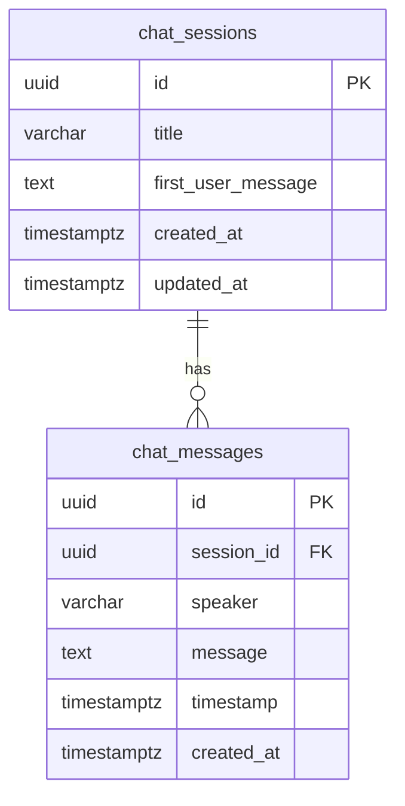

# 데이터베이스 스키마 문서

## 개요

음성 채팅 애플리케이션의 대화 기록을 저장하기 위한 데이터베이스 스키마입니다. PostgreSQL 17.6을 사용하며, Supabase에서 호스팅됩니다.

## 테이블 구조

### 1. `chat_sessions` 테이블

채팅 그룹(세션) 정보를 저장하는 테이블입니다. 각 연결 세션은 하나의 채팅 그룹으로 관리됩니다.

#### 컬럼 정보

| 컬럼명 | 데이터 타입 | 제약조건 | 기본값 | 설명 |
|--------|------------|----------|--------|------|
| `id` | `uuid` | PRIMARY KEY, NOT NULL | `gen_random_uuid()` | 세션 고유 식별자 |
| `title` | `varchar(255)` | NULL | - | 세션 제목 (첫 번째 사용자 메시지 기반 자동 생성) |
| `first_user_message` | `text` | NULL | - | 첫 번째 사용자 메시지 전체 (제목 생성용) |
| `created_at` | `timestamp with time zone` | NOT NULL | `now()` | 세션 생성 시간 |
| `updated_at` | `timestamp with time zone` | NOT NULL | `now()` | 세션 마지막 업데이트 시간 |

#### 인덱스

- `chat_sessions_pkey`: PRIMARY KEY 인덱스 (`id`)
- `chat_sessions_created_at_idx`: B-tree 인덱스 (`created_at DESC`) - 날짜별 조회 최적화

#### 트리거

- `set_updated_at_chat_sessions`: `updated_at` 컬럼을 자동으로 업데이트하는 BEFORE UPDATE 트리거

#### 참조 관계

- `chat_messages.session_id` → `chat_sessions.id` (ON DELETE CASCADE)

---

### 2. `chat_messages` 테이블

개별 대화 메시지를 저장하는 테이블입니다. 실시간으로 각 메시지가 생성될 때마다 저장됩니다.

#### 컬럼 정보

| 컬럼명 | 데이터 타입 | 제약조건 | 기본값 | 설명 |
|--------|------------|----------|--------|------|
| `id` | `uuid` | PRIMARY KEY, NOT NULL | `gen_random_uuid()` | 메시지 고유 식별자 |
| `session_id` | `uuid` | NOT NULL, FOREIGN KEY | - | `chat_sessions.id` 참조 |
| `speaker` | `varchar(50)` | NOT NULL, CHECK | - | 발화자 ('나', 'AI 선생님', '시스템') |
| `message` | `text` | NOT NULL | - | 메시지 내용 |
| `timestamp` | `timestamp with time zone` | NOT NULL | `now()` | 메시지 발생 시간 (클라이언트에서 전달된 시간) |
| `created_at` | `timestamp with time zone` | NOT NULL | `now()` | 레코드 생성 시간 (DB 저장 시간) |

#### 인덱스

- `chat_messages_pkey`: PRIMARY KEY 인덱스 (`id`)
- `chat_messages_session_id_idx`: B-tree 인덱스 (`session_id`) - 세션별 메시지 조회 최적화
- `chat_messages_timestamp_idx`: B-tree 인덱스 (`timestamp`) - 시간순 정렬 최적화
- `chat_messages_session_timestamp_idx`: B-tree 복합 인덱스 (`session_id`, `timestamp`) - 세션 내 시간순 조회 최적화

#### 제약조건

- **CHECK 제약조건**: `chat_messages_speaker_check`
  - `speaker`는 다음 중 하나만 허용: '나', 'AI 선생님', '시스템'
- **FOREIGN KEY 제약조건**: `chat_messages_session_id_fkey`
  - `session_id`는 `chat_sessions.id`를 참조
  - `ON DELETE CASCADE`: 세션이 삭제되면 관련 메시지도 함께 삭제

---

## 데이터베이스 함수

### `set_updated_at()`

`updated_at` 컬럼을 자동으로 업데이트하는 트리거 함수입니다.

**타입**: `trigger`

**소스 코드**:
```sql
BEGIN
  new.updated_at = now();
  return new;
END;
```

**사용 위치**: `chat_sessions` 테이블의 `set_updated_at_chat_sessions` 트리거

---

## ERD (Entity Relationship Diagram)



---

## 사용 예시 쿼리

### 1. 새 세션 생성

```sql
INSERT INTO chat_sessions (title, first_user_message)
VALUES ('Hello, how are...', 'Hello, how are you today?')
RETURNING id;
```

### 2. 메시지 저장

```sql
INSERT INTO chat_messages (session_id, speaker, message, timestamp)
VALUES (
  '550e8400-e29b-41d4-a716-446655440000'::uuid,
  '나',
  'Hello, how are you today?',
  '2024-01-15 14:30:00+09'::timestamptz
);
```

### 3. 세션 목록 조회 (최신순)

```sql
SELECT 
  id,
  title,
  created_at,
  updated_at,
  (SELECT COUNT(*) FROM chat_messages WHERE session_id = chat_sessions.id) as message_count
FROM chat_sessions
ORDER BY created_at DESC
LIMIT 20;
```

### 4. 특정 세션의 메시지 조회 (시간순)

```sql
SELECT 
  id,
  speaker,
  message,
  timestamp
FROM chat_messages
WHERE session_id = '550e8400-e29b-41d4-a716-446655440000'::uuid
ORDER BY timestamp ASC;
```

### 5. 세션 제목 업데이트 (첫 사용자 메시지 수신 시)

```sql
UPDATE chat_sessions
SET 
  title = LEFT('Hello, how are you today?', 50) || CASE WHEN LENGTH('Hello, how are you today?') > 50 THEN '...' ELSE '' END,
  first_user_message = 'Hello, how are you today?',
  updated_at = now()
WHERE id = '550e8400-e29b-41d4-a716-446655440000'::uuid;
```

### 6. 날짜별 세션 통계

```sql
SELECT 
  DATE(created_at) as date,
  COUNT(*) as session_count,
  SUM((SELECT COUNT(*) FROM chat_messages WHERE session_id = chat_sessions.id)) as total_messages
FROM chat_sessions
GROUP BY DATE(created_at)
ORDER BY date DESC;
```

### 7. 세션 삭제 (관련 메시지도 자동 삭제됨)

```sql
DELETE FROM chat_sessions
WHERE id = '550e8400-e29b-41d4-a716-446655440000'::uuid;
-- CASCADE로 인해 관련 chat_messages도 자동 삭제됨
```

---

## 확장 고려사항

### 향후 추가 가능한 기능

1. **사용자 식별**: 로그인 기능 추가 시 `user_id` 컬럼 추가
2. **세션 메타데이터**: 대화 주제, 언어 설정 등 추가 정보 저장
3. **메시지 타입**: 텍스트 외에 이미지, 파일 등 다양한 타입 지원
4. **소프트 삭제**: `deleted_at` 컬럼 추가로 삭제된 세션 복구 가능
5. **통계 테이블**: 세션별 통계 정보를 별도 테이블로 관리

---

## 마이그레이션 정보

- **마이그레이션 파일**: `migrations/001_create_chat_tables.sql`
- **실행 날짜**: 2024년 (마이그레이션 실행 시점)
- **데이터베이스**: PostgreSQL 17.6
- **확장 프로그램**: `pgcrypto`, `uuid-ossp`

---

## 참고사항

- 모든 타임스탬프는 `timestamp with time zone` 타입을 사용하여 시간대 정보를 포함합니다.
- UUID는 `gen_random_uuid()` 함수를 사용하여 자동 생성됩니다.
- `updated_at`은 트리거를 통해 자동으로 업데이트됩니다.
- 세션 삭제 시 관련 메시지는 CASCADE로 자동 삭제되므로 주의가 필요합니다.

