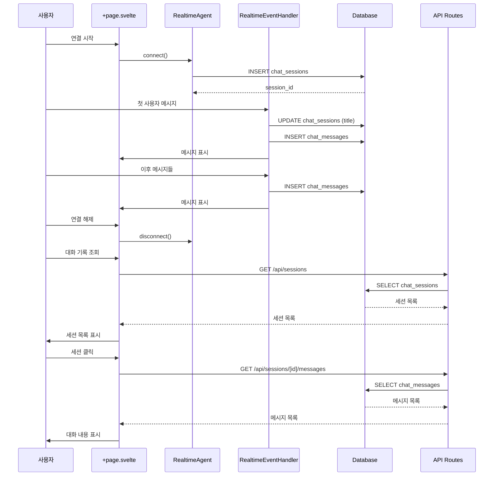

# 서비스 개선 계획

## 개요

음성 채팅 사용 기록을 날짜와 제목이 있는 채팅 그룹 단위로 조회할 수 있도록 서비스를 개선합니다. 로그인 없이 모든 사용자의 기록을 저장하고 관리합니다.

## 현재 상태

### 완료된 작업

1. **데이터베이스 스키마 설계 및 마이그레이션**
   - `chat_sessions` 테이블 생성 (채팅 그룹 정보)
   - `chat_messages` 테이블 생성 (개별 메시지)
   - 인덱스 및 제약조건 설정
   - `updated_at` 자동 업데이트 트리거 설정
   - 마이그레이션 실행 완료

2. **스키마 문서화**
   - 데이터베이스 스키마 상세 문서 작성
   - ERD 다이어그램 포함
   - 사용 예시 쿼리 제공

### 현재 기능

- 실시간 음성 대화 (WebRTC 기반)
- AI 영어 선생님과의 대화
- 메모리 내 대화 기록 표시 (세션 종료 시 소실)
- 연결 상태 모니터링

## 개선 목표

1. **대화 기록 영구 저장**: 데이터베이스에 대화 기록을 저장하여 세션 종료 후에도 조회 가능
2. **채팅 그룹 단위 관리**: 각 연결 세션을 하나의 채팅 그룹으로 관리
3. **제목 자동 생성**: 첫 번째 사용자 메시지를 기반으로 세션 제목 자동 생성
4. **과거 대화 조회**: 날짜와 제목으로 과거 대화 기록을 조회할 수 있는 UI 제공

## 구현 계획

### 1단계: 데이터베이스 연결 설정

#### 1.1 환경 변수 설정
- Supabase 데이터베이스 연결 정보를 환경 변수로 관리
- `.env` 파일에 데이터베이스 URL 추가

#### 1.2 데이터베이스 클라이언트 설정
- PostgreSQL 클라이언트 라이브러리 설치 (`pg` 또는 `postgres.js`)
- 데이터베이스 연결 풀 설정
- 연결 관리 유틸리티 생성

**파일 위치**:
- `src/lib/db/client.js` - 데이터베이스 클라이언트 설정
- `src/lib/db/queries.js` - 쿼리 함수들

### 2단계: 세션 관리 로직 구현

#### 2.1 세션 생성
- 연결 시작 시 새 세션 생성
- `chat_sessions` 테이블에 레코드 삽입
- 세션 ID를 클라이언트 상태에 저장

**구현 위치**: `src/lib/components/RealtimeAgent.svelte` 또는 새로운 `SessionManager.js`

#### 2.2 제목 자동 생성
- 첫 번째 사용자 메시지 수신 시
- 메시지 앞부분 50자 추출
- 50자 초과 시 "..." 추가
- `chat_sessions` 테이블의 `title` 및 `first_user_message` 업데이트

**구현 위치**: `src/lib/components/RealtimeEventHandler.js` 또는 `SessionManager.js`

#### 2.3 세션 업데이트
- 세션 종료 시 `updated_at` 자동 업데이트 (트리거 처리)
- 필요 시 추가 메타데이터 저장

### 3단계: 메시지 저장 로직 구현

#### 3.1 실시간 메시지 저장
- `RealtimeEventHandler.js`에서 메시지 이벤트 수신 시
- `chat_messages` 테이블에 즉시 저장
- 비동기 처리로 UI 블로킹 방지

**구현 위치**: `src/lib/components/RealtimeEventHandler.js`

#### 3.2 메시지 데이터 구조
```javascript
{
  session_id: string,  // UUID
  speaker: '나' | 'AI 선생님' | '시스템',
  message: string,
  timestamp: Date  // 클라이언트에서 전달된 시간
}
```

### 4단계: API 엔드포인트 생성

#### 4.1 세션 목록 조회 API
- `GET /api/sessions`
- 최신순으로 세션 목록 반환
- 페이지네이션 지원 (선택사항)

**응답 형식**:
```json
{
  "sessions": [
    {
      "id": "uuid",
      "title": "Hello, how are...",
      "created_at": "2024-01-15T14:30:00Z",
      "updated_at": "2024-01-15T15:00:00Z",
      "message_count": 25
    }
  ]
}
```

**파일 위치**: `src/routes/api/sessions/+server.js`

#### 4.2 특정 세션의 메시지 조회 API
- `GET /api/sessions/[id]/messages`
- 세션 ID로 해당 세션의 모든 메시지 조회
- 시간순 정렬

**응답 형식**:
```json
{
  "session_id": "uuid",
  "messages": [
    {
      "id": "uuid",
      "speaker": "나",
      "message": "Hello, how are you?",
      "timestamp": "2024-01-15T14:30:00Z"
    }
  ]
}
```

**파일 위치**: `src/routes/api/sessions/[id]/messages/+server.js`

#### 4.3 세션 생성 API (선택사항)
- `POST /api/sessions`
- 클라이언트에서 직접 세션 생성 시 사용
- 현재는 연결 시작 시 자동 생성하므로 선택사항

**파일 위치**: `src/routes/api/sessions/+server.js`

### 5단계: UI 개선

#### 5.1 대화 기록 페이지 생성
- 새로운 페이지: `src/routes/history/+page.svelte`
- 세션 목록 표시
- 날짜별 그룹화
- 제목, 생성 시간, 메시지 개수 표시

#### 5.2 세션 상세 페이지 생성
- 새로운 페이지: `src/routes/history/[id]/+page.svelte`
- 특정 세션의 모든 메시지 표시
- 기존 `ConversationLog.svelte` 컴포넌트 재사용 가능

#### 5.3 네비게이션 추가
- 메인 페이지에서 대화 기록 페이지로 이동하는 링크 추가
- 헤더 또는 사이드바에 네비게이션 메뉴 추가

#### 5.4 UI 컴포넌트
- `SessionList.svelte`: 세션 목록 표시 컴포넌트
- `SessionCard.svelte`: 개별 세션 카드 컴포넌트
- 기존 `ConversationLog.svelte` 재사용

## 데이터 흐름



## 구현 우선순위

### Phase 1: 핵심 기능 (필수)
1. 데이터베이스 연결 설정
2. 세션 생성 로직
3. 메시지 저장 로직
4. 제목 자동 생성

### Phase 2: 조회 기능 (필수)
5. 세션 목록 조회 API
6. 메시지 조회 API
7. 대화 기록 페이지 UI

### Phase 3: 개선 사항 (선택)
8. 페이지네이션
9. 검색 기능
10. 세션 삭제 기능
11. 통계 정보 표시

## 기술 스택 추가

### 필요한 패키지
- `pg` 또는 `postgres.js`: PostgreSQL 클라이언트
- (선택) `@supabase/supabase-js`: Supabase 클라이언트 SDK

### 설치 명령어
```bash
npm install pg
# 또는
npm install @supabase/supabase-js
```

## 보안 고려사항

1. **SQL Injection 방지**: 파라미터화된 쿼리 사용
2. **에러 처리**: 데이터베이스 에러가 사용자에게 노출되지 않도록 처리
3. **연결 풀 관리**: 적절한 연결 풀 크기 설정
4. **환경 변수 보호**: 데이터베이스 연결 정보는 서버 사이드에서만 사용

## 테스트 계획

1. **단위 테스트**: 데이터베이스 쿼리 함수 테스트
2. **통합 테스트**: API 엔드포인트 테스트
3. **E2E 테스트**: 전체 플로우 테스트 (연결 → 대화 → 저장 → 조회)

## 성능 고려사항

1. **인덱스 활용**: 이미 생성된 인덱스로 빠른 조회 보장
2. **비동기 처리**: 메시지 저장은 비동기로 처리하여 UI 블로킹 방지
3. **연결 풀**: 데이터베이스 연결 풀을 사용하여 연결 오버헤드 최소화
4. **캐싱**: 세션 목록은 적절한 캐싱 전략 고려 (선택사항)

## 다음 단계

1. 데이터베이스 클라이언트 설정 및 연결 테스트
2. 세션 생성 로직 구현 및 테스트
3. 메시지 저장 로직 구현 및 테스트
4. API 엔드포인트 구현 및 테스트
5. UI 구현 및 통합 테스트
6. 전체 플로우 테스트 및 버그 수정

